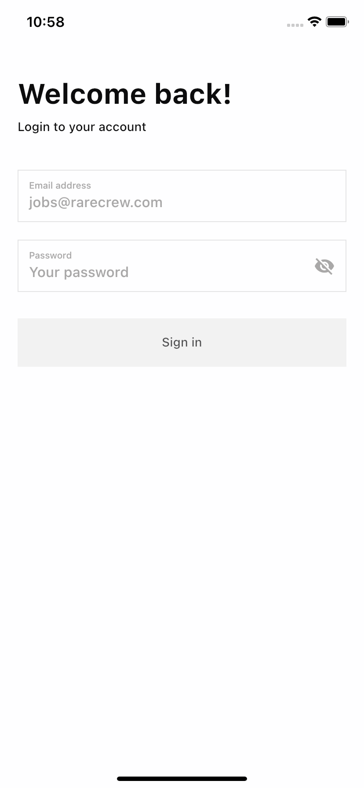
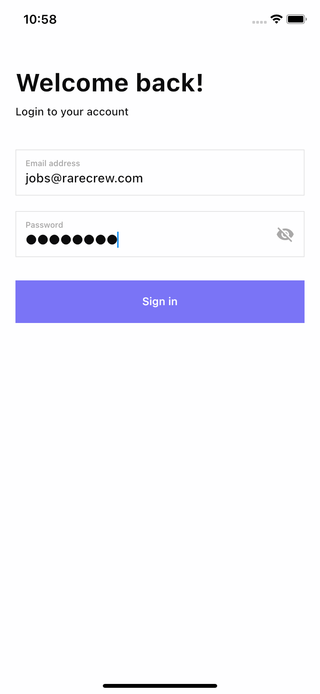
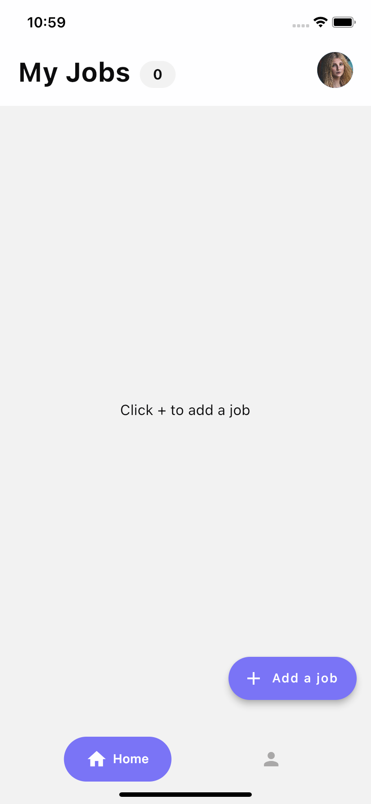
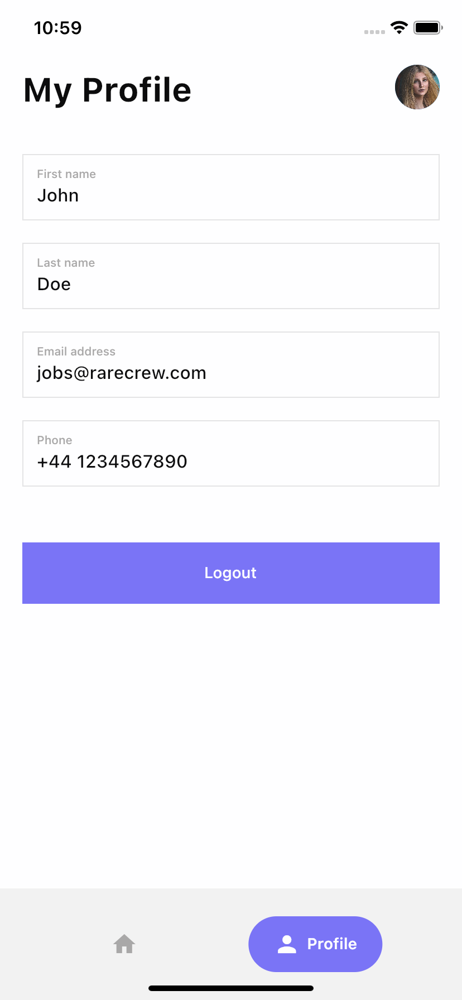
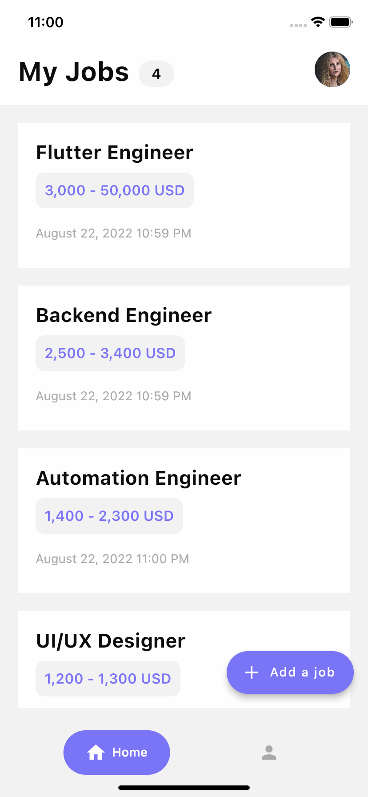
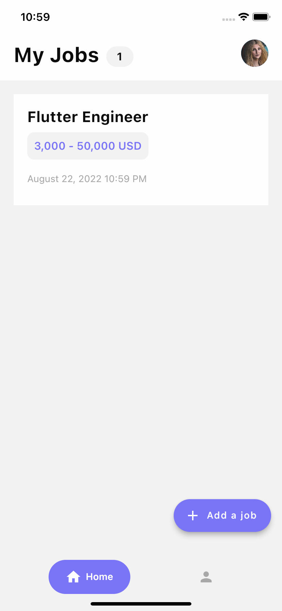
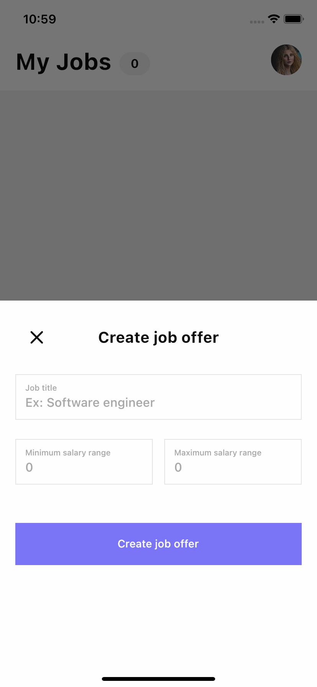
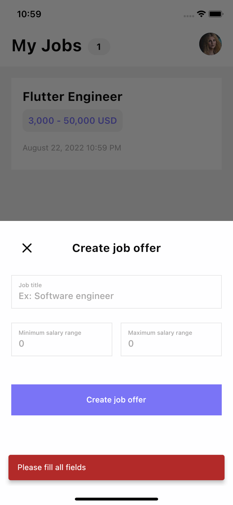
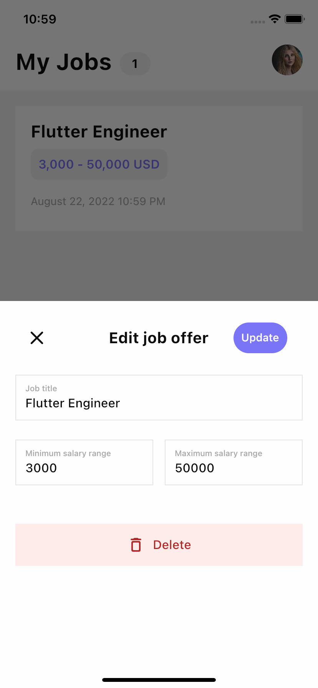
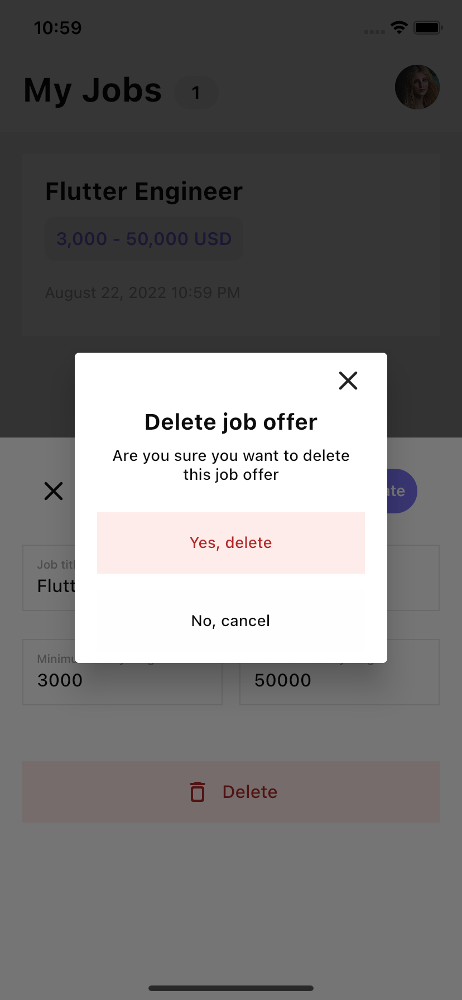

# Rare Crew Assessment

## Features
- [x] Sign In (JWT + refresh token)
- [x] Create Job offers
- [x] Edit Job Offers
- [x] Delete Job Offers
- [x] View Profile
- [x] Logout

## Screenshots

| SignIn Screen - Not Filled | SignIn Screen - Filled | 
|    :---:     |     :---:      |  
|    |    |

| Home Screen - Empty | Profile Screen | 
|    :---:     |     :---:      |  
|    |    |

| Home Screen - 4 Jobs | Home Screen - 1 Job | 
|    :---:     |     :---:      |  
|    |    |

| Create Job - Empty | Create Job - Filled | 
|    :---:     |     :---:      |  
|    |    |

| Create Job - Error | Edit Job | 
|    :---:     |     :---:      |  
|    |    |

| Delete Job | Delete Job - Confirmation | 
|    :---:     |     :---:      |  
|    |    |

## Running Tests 

To run all unit tests use the following command:

```flutter test```

